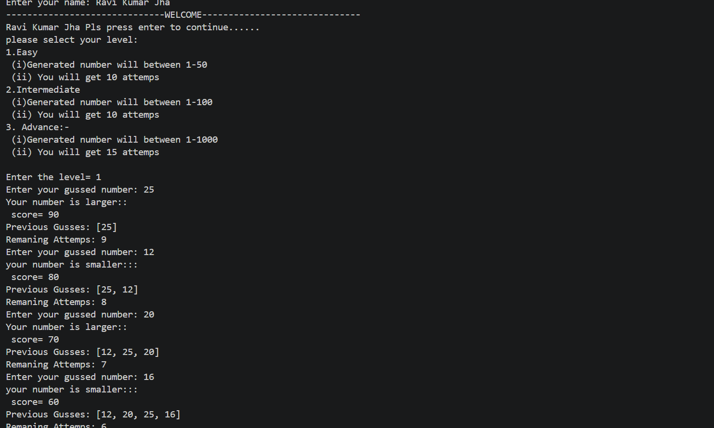
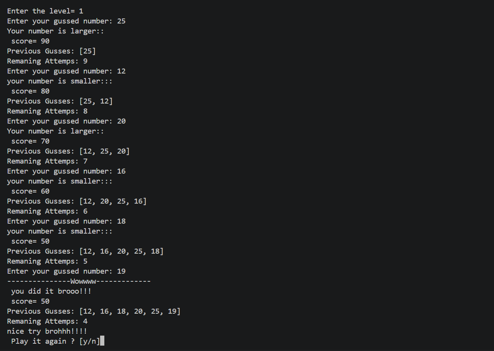

# 🎯 Number Guessing Game

A console-based Number Guessing Game developed in Python.

This project demonstrates fundamental Python programming concepts including:

- Functions
- Loops
- Conditional Statements
- User Input Validation
- Random Number Generation
- Lists
- Score Tracking

## Features

- Three Difficulty Levels
- Score System
- Guess History
- Replay Option
- Input Validation

## Technologies Used

- Python 3

## How to Run

```bash
python main.py
```

## Future Improvements

- High Score System
- Hint System
- Better UI
- File Handling
- GUI Version (Tkinter)

## Screenshots

### Main Menu



### Gameplay



## Author

Ravi Kumar Jha
